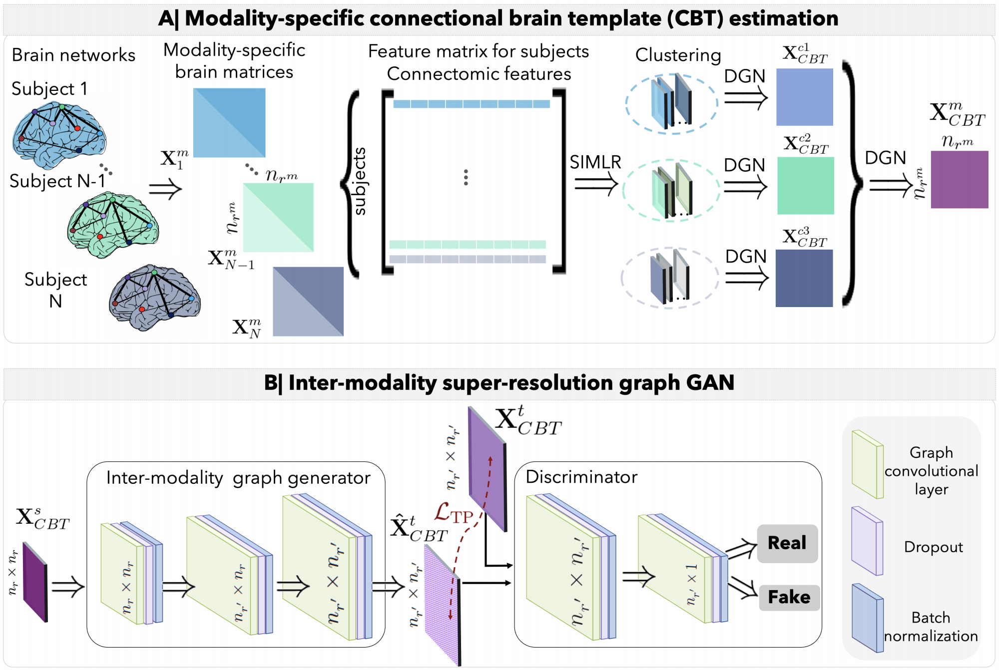
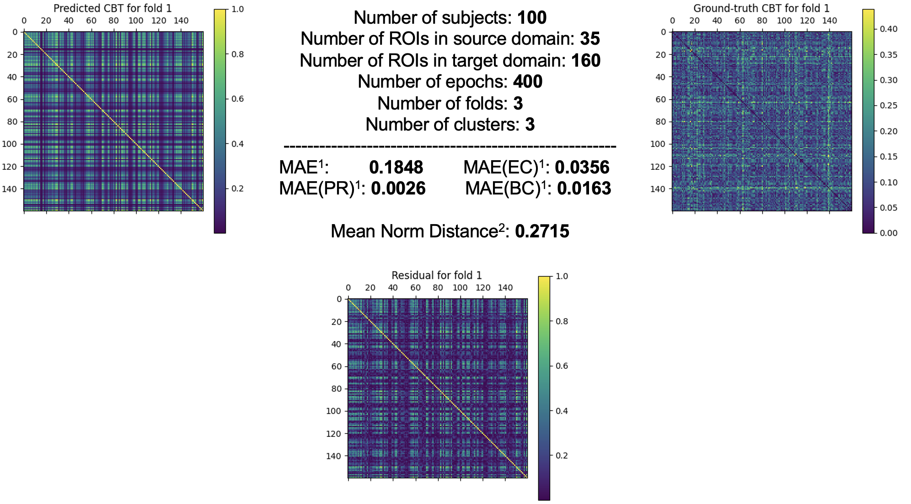

# Template-Based Inter-modality Super-resolution of Brain Connectivity (TIS-Net)
TIS-Net is a framework for super-resolving cross-modality brain graphs using one shot learning (i.e., a single training sample).

Please contact pala18@itu.edu.tr for inquiries. Thanks. 



# Introduction
This work is accepted at the PRIME-MICCAI 2021 workshop. 

> **Template-Based Inter-modality Super-resolution of Brain Connectivity**<br/>
> [Furkan Pala](https://orcid.org/0000-0002-1260-7585)<sup>1,†</sup>, [Islem Mhiri](https://orcid.org/0000-0002-1404-9476)<sup>1,2,†</sup>, and [Islem Rekik](https://orcid.org/0000-0001-5595-6673)<sup>1,*</sup><br/>
> <sup>1</sup> BASIRA Lab, Faculty of Computer and Informatics, Istanbul Technical University, Istanbul, Turkey<br/>
> <sup>2</sup> Laboratory of Advanced Technology and Intelligent Systems, National Engineering School of Sousse, Tunisia<br/>
> <sup>\*</sup> corresponding author: irekik@itu.edu.tr, https://basira-lab.com/<br/>
> <sup>†</sup> co-first authors<br/>
>
> **Abstract:** *Brain graph synthesis becomes a challenging task when generating brain graphs across different modalities. Although promising, existing multimodal brain graph synthesis frameworks based on deep learning have several limitations. First, they mainly focus on predicting intra-modality graphs, overlooking the rich multimodal representations of brain connectivity (inter-modality). Second, while few techniques work on super-resolving low-resolution brain graphs within a single modality (i.e., intra), inter-modality graph super-resolution remains unexplored though this avoids the need for costly data collection and processing. More importantly, all these works need large amounts of training data which is not always feasible due to the scarce neuroimaging datasets especially for low resource clinical facilities and rare diseases. To fill these gaps, we propose an inter-modality super-resolution brain graph synthesis (TIS-Net) framework trained on one population driven atlas namely-connectional brain template (CBT). Our TIS-Net is grounded in three main contributions: (i) predicting a target representative template from a source one based on a novel graph generative adversarial network, (ii) generating high-resolution representative brain graph without resorting to the time consuming and expensive MRI processing steps, and (iii) training our framework using one shot learning where we estimate a representative and well centered CBT (i.e., one shot) with shared common traits across subjects. Moreover, we design a new Target Preserving loss function to guide the generator in learning the structure of target the CBT more accurately. Our comprehensive experiments on predicting a target CBT from a source CBT using our method showed the outperformance of TIS-Net in comparison with its variants. TIS-Net presents the first work for graph synthesis based on one representative shot across varying modalities and resolutions, which handles graph size, and structure variations. Our Python TIS-Net code is available on BASIRA GitHub at https://github.com/basiralab/TIS-Net*

# Code
This project was implemented using Python 3.6.9 on a Linux platform.

## Installation
Create a virtual env using the following command
```sh
python3 -m venv TIS_NET
```
Activate the virtual env using the following command
```sh
source TIS_NET/bin/activate
```
Use `pip` to install dependencies. Note that we developed the project on a CUDA supported system. Our CUDA version is 10.1, so the installion commands below include `cu101`.
```sh
pip install torch==1.8.0+cu101 -f https://download.pytorch.org/whl/torch_stable.html
pip install torch-scatter -f https://pytorch-geometric.com/whl/torch-1.8.0+cu101.html
pip install torch-sparse -f https://pytorch-geometric.com/whl/torch-1.8.0+cu101.html
pip install torch-geometric
pip install matplotlib
pip install fbpca
pip install annoy
```
For CPU installation or another version of CUDA or `PyTorch`, check out [PyTorch Geometric Docs](https://pytorch-geometric.readthedocs.io/en/latest/notes/installation.html) and [PyTorch Website](https://pytorch.org/). <br/>
Also our framework depends on [SIMLR](https://github.com/bowang87/SIMLR_PY) framework of which source code is also included in this repository in `/SIMLR_PY` folder.

## Running TIS-Net
To run TIS-Net, use the following command
```sh
python3 demo.py
```
Make sure that your virtual env is activated.<br/>
##### You can edit the `config.py` file according to your needs by changing hyperparameters such as number of epochs for training, and you can feed an external dataset or change the shape of the simulated data.

## Data format
TIS-Net framework needs `source` and `target` data to run. Each of these data represents a bunch of subjects and their brain graphs (networks). Note that our framework is based on single-view brain graphs. A brain graph can be represented as an adjacency matrix with shape
```
[num_ROIs x num_ROIs]
```
where `num_ROIs` is number of region of interests in the brain graph, different for `source` and `target` datasets since our framework offers an inter-modality mapping. However, a more compact way to store this matrix is vectorizing its upper-triangular part so that this matrix can be represented as a vector with
```
num_ROIs x (num_ROIs - 1) / 2
```
elements. Let us define this number as `num_features` since, intuitively, each subject has this amount of features. <br/><br/>
Now, we can specify the shape of `source` and `target` datasets which are
```
[num_subjects x num_features]
```
`num_features` is different for `source` and `target` datasets.<br/><br/>
You can either supply an external dataset by assigning `DATASET=E` in `config.py` file or use a simulated dataset (created using random normal distribution) by specifying number of ROIs in both `source` and `target` domains via changing `N_SOURCE_NODES` and `N_TARGET_NODES` variables, respectively. You can also specify number of subjects with `N_SUBJECTS` variable.

## Components of DGN’s Code
| Component | Content |
| ------ | ------ |
| `config.py` | Includes hyperparameter and other options. You may modify it according to your needs. |
| `model.py` | Implementation of the model. |
| `demo.py`| Driver code that import variables from `config.py`, trains and tests TIS-Net using k-fold cross-validation.  |
| `helper.py` | Includes some helper functions such as preprocessing data and printing functions. |
| `centrality.py` | Includes functions for calculating pagerank, eigenvector and betweenness centralities. These are called topological measures in our project. |
| `/models` <sup>1</sup> | Stores the weights of trained models under the `/MODEL_NAME` folder. MODEL_NAME can be specified in `config.py`. |
| `/output` <sup>1</sup>  | Stores the figures of predicted and ground-truth CBTs together with residuals under the `/MODEL_NAME` folder. |
| `/data` <sup>1</sup>| Stores the generated simulated data under the `/MODEL_NAME` folder. |
##### <sup>1</sup> This is an auto-generated folder and created when the program is executed.
  
## Example Result

The figure above shows an example result of predicted and ground-truth CBT together with residual between them trained and tested using a simulated data, `source` domain with 35 ROIs and `target` domain with 160 ROIs.
* MAE: Mean Absolute Error
* PR: Pagerank centrality
* EC: Eigenvector centrality
* BC: Betweenness centrality

##### <sup>1</sup> Calculated between predicted and ground-truth CBT.<br/>
##### <sup>2</sup> Calculated between predicted CBT and each test sample in target domain.

## Please cite the following paper when using DGN
```latex
  @inproceedings{pala2021,
    title={Template-Based Inter-modality Super-resolution of Brain Connectivity (TIS-Net)},
    author={Pala, Furkan and Mhiri, Islem and Rekik, Islem},
    booktitle={International Workshop on PRedictive Intelligence In MEdicine},
    year={2021},
    organization={Springer}
  }
```
